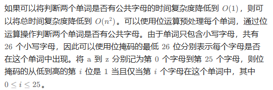

# 23-10-31 275.H指数2

[275. H 指数 II - 力扣（LeetCode）](https://leetcode.cn/problems/h-index-ii/description/)

给你一个整数数组 `citations` ，其中 `citations[i]` 表示研究者的第 `i` 篇论文被引用的次数，`citations` 已经按照 **升序排列** 。计算并返回该研究者的 h ******指数。

[h 指数的定义](https://baike.baidu.com/item/h-index/3991452?fr=aladdin)：h 代表“高引用次数”（high citations），一名科研人员的 `h` 指数是指他（她）的 （`n` 篇论文中）**总共**有 `h` 篇论文分别被引用了**至少** `h` 次。

请你设计并实现对数时间复杂度的算法解决此问题。

**示例 1：**

```
输入：citations = [0,1,3,5,6]输出：3解释：给定数组表示研究者总共有5 篇论文，每篇论文相应的被引用了0, 1, 3, 5, 6 次。
     由于研究者有3篇论文每篇 至少被引用了3 次，其余两篇论文每篇被引用 不多于3 次，所以她的 h指数是3 。
```

**示例 2：**

```
输入：citations = [1,2,100]输出：2
```

------

## 思路

使用二分法，因为题目中告诉了数组是升序，而且时间复杂度为对数。

- 如果至少有2篇论文的引用次数≥2，那么必然也至少有1篇论文的引用次数≥1.
- 如果没有4篇论文的引用次数≥4，那么必然没有5篇论文的引用次数≥5.

- 闭区间写法

```cpp
class Solution {
public:
    int hIndex(vector<int>& citations) {
        int n = citations.size();
        int left = 1;
        int right = n;
        //二分法 闭区间写法
        while(left <= right){
            int mid = left + (right - left) / 2;
            //关键步骤 引用次数最多的 mid 篇论文，引用次数均 >= mid
            if(citations[n - mid] >= mid){
                left = mid + 1;
            }
            else{
                right = mid - 1;
            }
        }
        return right;
    }
};
时间复杂度O(log n)
空间复杂度O(1)
```

- 左闭右开区间写法

```cpp
class Solution {
public:
    int hIndex(vector<int> &citations) {
        // 在区间 (left, right] 内询问
        int n = citations.size();
        int left = 0;
        int right = n;
        while (left < right) { // 区间不为空
            // 循环不变量：
            // left 的回答一定为「是」
            // right+1 的回答一定为「否」
            int mid = (left + right + 1) / 2; // 保证 mid 在二分区间内
            // 引用次数最多的 mid 篇论文，引用次数均 >= mid
            if (citations[n - mid] >= mid) {
                left = mid; // 询问范围缩小到 (mid, right]
            } else {
                right = mid - 1; // 询问范围缩小到 (left, mid-1]
            }
        }
        // 根据循环不变量，left 现在是最大的回答为「是」的数
        return left;
    }
};
```

# 23-11-1 2127.参加会议的最多员工数

[2127. 参加会议的最多员工数 - 力扣（LeetCode）](https://leetcode.cn/problems/maximum-employees-to-be-invited-to-a-meeting/description/?envType=daily-question&envId=2023-11-01)

```cpp
class Solution {
public:
    int maximumInvitations(vector<int>& favorite) {
        int n = favorite.size();
        // 统计入度，便于进行拓扑排序
        vector<int> indeg(n);
        for (int i = 0; i < n; ++i) {
            ++indeg[favorite[i]];
        }
        vector<int> used(n), f(n, 1);
        queue<int> q;
        for (int i = 0; i < n; ++i) {
            if (!indeg[i]) {
                q.push(i);
            }
        }
        while (!q.empty()) {
            int u = q.front();
            used[u] = true;
            q.pop();
            int v = favorite[u];
            // 状态转移
            f[v] = max(f[v], f[u] + 1);
            --indeg[v];
            if (!indeg[v]) {
                q.push(v);
            }
        }
        // ring 表示最大的环的大小
        // total 表示所有环大小为 2 的「基环内向树」上的最长的「双向游走」路径之和
        int ring = 0, total = 0;
        for (int i = 0; i < n; ++i) {
            if (!used[i]) {
                int j = favorite[i];
                // favorite[favorite[i]] = i 说明环的大小为 2
                if (favorite[j] == i) {
                    total += f[i] + f[j];
                    used[i] = used[j] = true;
                }
                // 否则环的大小至少为 3，我们需要找出环
                else {
                    int u = i, cnt = 0;
                    while (true) {
                        ++cnt;
                        u = favorite[u];
                        used[u] = true;
                        if (u == i) {
                            break;
                        }
                    }
                    ring = max(ring, cnt);
                }
            }
        }
        return max(ring, total);
    }
};
```

官方题解连接：

[2127. 参加会议的最多员工数 - 力扣（LeetCode）](https://leetcode.cn/problems/maximum-employees-to-be-invited-to-a-meeting/solutions/1190222/can-jia-hui-yi-de-zui-duo-yuan-gong-shu-u8e8u/?envType=daily-question&envId=2023-11-01)

# 23-11-2 2103.环和杆

[2103. 环和杆 - 力扣（LeetCode）](https://leetcode.cn/problems/rings-and-rods/description/?envType=daily-question&envId=2023-11-02)

## 思路

使用二进制位数表示一个杆子上的颜色。

如果某个杆子对应的值为111，即表示有RGB三种颜色，如果是000，则为无颜色。

在杆子上添加颜色环时使用位或运算即可添加。如001 | 1 = 001，杆子上还是001。

**显然这种方法只能判断是否有某种颜色环，不能数有几个环。**

- constexpr关键字

  `constexpr` 是 C++11 引入的关键字，用于声明可以在编译时计算出结果的常量表达式。

  在 C++ 的早期版本中，只有在运行时才能计算常量表达式的值。而 **`constexpr` 关键字的引入使得编译器能够在编译时对表达式进行求解，将其结果作为常量值进行使用。**

  使用 `constexpr` 修饰的变量或函数在满足以下条件时可以被视为常量表达式：

  1. 它的类型是字面量类型（如整数、浮点数、指针、引用）。
  2. 它的表达式只包含字面量、对其他 `constexpr` 变量的引用和可求值的 `constexpr` 函数调用。
  3. 其所有构造函数都必须是 `constexpr` 的。

  `constexpr` 变量可以在编译时进行计算，并在运行时使用，而 `constexpr` 函数则可以在编译时进行求值。这使得开发者可以在编译时得到更高效、更安全的代码。

  下面是一些使用 `constexpr` 的示例：

  ```cpp
  constexpr int factorial(int n) {
      return (n <= 1) ? 1 : n * factorial(n - 1);
  }
  
  constexpr int num = 10;
  constexpr int result = factorial(num);  // 在编译时计算出结果并赋给常量
  
  int main() {
      static_assert(result == 3628800, "Incorrect factorial calculation");  
  		// 编译时断言
      return 0;
  }
  ```

  在上述示例中，`factorial` 函数被声明为 `constexpr`，它在编译时递归计算了一个整数的阶乘。`num` 和 `result` 变量也被声明为 `constexpr`，并在编译时计算出阶乘结果。`static_assert` 断言用于在编译时验证结果是否正确。

  通过使用 `constexpr`，我们可以在编译时进行常量表达式的计算，提高代码的性能和可靠性。

```cpp
class Solution {
public:
    static constexpr int POLE_NUM = 10;
    int countPoints(string rings) {
        //定义state存放每个杆的状态
        vector<int> state(POLE_NUM);
        int n = rings.size();
        for(int i = 0; i < n; i += 2){
            char color = rings[i];
            //注意rings中的数字为char,需要转换为int
            int ploeIndex = rings[i+1] - '0';
            //判断颜色进行分类
            if(color == 'R')    state[ploeIndex] |= 1;
            else if(color == 'G')    state[ploeIndex] |= 2;
            else state[ploeIndex] |= 4;
        }
        int res = 0;
        for(int i = 0; i < POLE_NUM; i++){
            //这一句很精简 如果是111,则该杆子上有三个颜色
            res += state[i] == 7;
        }
        return res;
    }
};
时间复杂度：O(nk+m)
其中 n为 rings的长度，k 为颜色的数量（在本题中固定为 3），m 为杆的数量（在本题中固定为10）
空间复杂度：O(m)O(m)O(m)
```

## 方法2 使用二维数组（10*3）来维护每个杆子状态

```cpp
class Solution {
public:
    static constexpr int POLE_NUM = 10;
    static constexpr int COLOR_NUM = 3;
    //颜色分类函数
    int getColorId(char color) {
        if (color == 'R') {
            return 0;
        } else if (color == 'G') {
            return 1;
        }
        return 2;
    }
    int countPoints(string rings) {
        vector<vector<int>> state(POLE_NUM, vector<int>(COLOR_NUM, 0));
        int n = rings.size();
        for (int i = 0; i < n; i += 2) {
            char color = rings[i];
            int pole_index = rings[i + 1] - '0';
            //有颜色环对应位置为1
            state[pole_index][getColorId(color)] = 1;
        }
        int res = 0;
        //遍历二维数组
        for (int i = 0; i < POLE_NUM; i++) {
            bool flag = true;
            for (int j = 0; j < COLOR_NUM; j++) {
                if (state[i][j] == 0) {
                    //只要有一个位为0 缺一个颜色 直接break
                    flag = false;
                    break;
                }
            }
            if (flag) {
                res++;
            }
        }
        return res;
    }
};

作者：力扣官方题解
链接：<https://leetcode.cn/problems/rings-and-rods/>
来源：力扣（LeetCode）
著作权归作者所有。商业转载请联系作者获得授权，非商业转载请注明出处。
```

# 23-11-3 117.填充每个节点的下一个右侧节点指针

> 层序遍历方法，在单层遍历的时候记录一下本层的头结点，然后在遍历的时候让前一个节点指向本节点即可。

层序遍历示意图如下：


```cpp
class Solution {
public:
    Node* connect(Node* root) {
        queue<Node*> que;
        if(root != NULL) que.push(root);
        while(!que.empty()){
            int size = que.size();
            Node* nodePre;
            Node* node;
            for(int i = 0; i < size; i++){
                if(i == 0){
                    //取出一层的头结点
                    nodePre = que.front();
                    que.pop();
                    node = nodePre;
                }else{
                    node = que.front();
                    que.pop();
                    // 关键逻辑 本层前一个节点next指向本节点
                    nodePre->next = node;
                    nodePre = nodePre->next;
                }
                if(node->left) que.push(node->left);
                if(node->right) que.push(node->right);
            }
            nodePre->next = NULL;//本层最后一个节点指向NULL
        }
        return root;
    }
};
```

# 23-11-4 421.数组中两个数的最大异或值

> 异或运算：二进制不同为0 ，相同为1

[421. 数组中两个数的最大异或值 - 力扣（LeetCode）](https://leetcode.cn/problems/maximum-xor-of-two-numbers-in-an-array/solutions/2511644/tu-jie-jian-ji-gao-xiao-yi-tu-miao-dong-1427d/?envType=daily-question&envId=2023-11-04)

```cpp
class Solution {
public:
    int findMaximumXOR(vector<int>& nums) {
        int mx = *max_element(nums.begin(), nums.end());
        int high_bit = mx ? 31 - __builtin_clz(mx) : -1;

        int ans = 0, mask = 0;
        unordered_set<int> seen;
        for(int i = high_bit; i >= 0; i--){
            seen.clear();
            mask |= 1 << i;
            int new_ans = ans | (1 << i);
            for(int x : nums){
                x &= mask;
                if(seen.contains(new_ans ^ x)){
                    ans = new_ans;
                    break;
                }
                seen.insert(x);
            }
        }
        return ans;
    }
};
```

# 23-11-5187.重复的DNA序列

[187. 重复的DNA序列 - 力扣（LeetCode）](https://leetcode.cn/problems/repeated-dna-sequences/description/?envType=daily-question&envId=2023-11-05)

- 使用map哈希表，记录长度为10的字符串出现的次数

```cpp
class Solution {
public:
    vector<string> findRepeatedDnaSequences(string s) {
        //存放符合条件的字符串
        vector<string> res;
        //每一个长度为10的子串和出现的次数
        unordered_map<string, int> umap;
        for(int i = 0; i <= (int)(s.length()) - 10; i++){
            //截取前10的字符串 后面的10为截取长度
            string str = s.substr(i, 10);
            umap[str]++;
            if(umap[str] == 2){
                //出现次数大于1
                res.push_back(str);
            }
        }
        return res;
    }
};
```

# 23-11-6 318. 最大单词长度乘积

[318. 最大单词长度乘积 - 力扣（LeetCode）](https://leetcode.cn/problems/maximum-product-of-word-lengths/description/?envType=daily-question&envId=2023-11-06)

- 遍历数组中每一对单词，如果没有公共字母则使用这一对单词长度乘积更新最大单词长度乘积
- 此时的时间复杂度为O n^2
- 如何将判断两个单词是否有公共字母的时间复杂度变为O 1
- 使用位运算处理每一个单词



```cpp
class Solution {
public:
    int maxProduct(vector<string>& words) {
        //bit存放位值 如abc代表111
        vector<int> bit(words.size());
        for(int i = 0; i < words.size(); i++){
            for(char ch : words[i]){
                bit[i] |= 1 << (ch - 'a');
            }
        }
        int ans = 0;
        for(int i = 0; i < bit.size(); i++){
            for(int j = i + 1; j < bit.size(); j++){
                //判断是否有相同字母，如果有，则或运算结果不为0
                if(!(bit[i] & bit[j])){
                    //注意使用max函数必须为int型
                    ans = max(ans, (int)(words[i].length() * words[j].length()));
                }
            }
        }
        return ans;
    }
};
```

# 23-11-7 2586.统计范围内的元音字符串数
